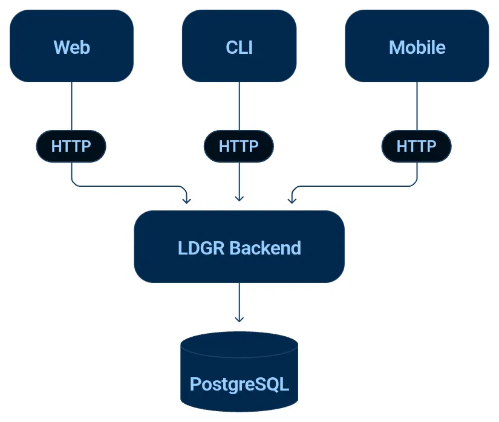
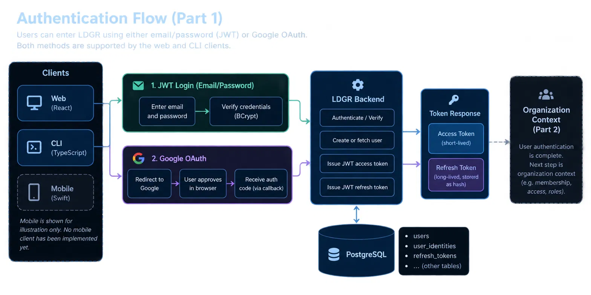

# Architecture

## Overview

LDGR is a polyglot monorepo. The backend is the brain. Every client — web,
CLI, mobile, or anything built in the future — speaks HTTP to the same backend
and owns nothing except presentation.



No client needs to understand Spring Boot. No client owns business logic.
The contract between clients and backend is HTTP. A new client in any language
is a new HTTP consumer — nothing else changes.

## Repository structure
ldgr/
├── backend/ Spring Boot — the financial engine
├── cli/ TypeScript — terminal access to LDGR
├── web/ React — browser access to LDGR
└── docker-compose.yml

Each module has its own toolchain, its own dependency management, and its own
release lifecycle. They share nothing except the HTTP contract with the backend.

## Backend

**Technology:** Java 21, Spring Boot, PostgreSQL 17, Flyway

The backend owns all financial logic, all authentication, all authorisation,
and all data. It is the only component that touches the database.

**Package structure:**
com.ldgr.backend
├── common/ Cross-cutting concerns (exception handling)
├── identity/ User registration, login, token lifecycle
│ ├── controller/
│ ├── dto/
│ ├── entity/
│ ├── repository/
│ └── service/
└── security/ JWT, OAuth2, filter chain
├── config/
├── jwt/
└── oauth/

The `identity` domain owns everything about who a user is. The `security`
package owns everything about proving it. They are deliberately separate —
identity is a domain concept, security is infrastructure.

**Database migrations** are managed by Flyway. The schema is versioned and
applied automatically on startup. No manual SQL. No schema drift.

## Database

**PostgreSQL 17**, running in Docker for local development.

The schema is designed for multi-tenancy from the first migration. The
foundational entities are:

**`users`** — Global LDGR identity. One record per human. Authentication
provider agnostic. A user exists independently of any organisation.

**`user_identities`** — How a user proves who they are. A user can have
multiple identity providers — password, Google OAuth, and others in future —
without duplicating the user record.

**`organizations`** — A tenant. A business entity. Every financial record in
LDGR belongs to an organisation. Identified by a short `og_code` for human
use.

**`organization_memberships`** — The join between a global user and an
organisation. Carries a role (`OWNER`, `ADMIN`, `ACCOUNTANT`, `VIEWER`) and
a status. Authentication and membership are explicitly separated — a valid
LDGR user has no access to an organisation until a membership record exists.

**`onboarding_forms` / `onboarding_form_fields`** — Each organisation
configures its own access-request form. Dynamic fields. Configurable per
organisation.

**`access_requests` / `access_request_answers`** — A user requests membership
in an organisation by submitting the organisation's onboarding form. An owner
or admin approves or rejects it. The OG code identifies the organisation — it
never grants access by itself.

**`refresh_tokens`** — Server-side session control. Tokens are stored as
SHA-256 hashes. Revocation is explicit. Token type is enforced in the JWT
claim — an access token cannot be used at the refresh endpoint.

## Authentication



LDGR supports two authentication paths today:

**Password** — email + password login. Credentials verified against
`users.password_hash` (BCrypt). Issues a JWT access token and a JWT refresh
token on success.

**Google OAuth** — browser-initiated OAuth2 flow. On success, the backend
upserts the user record and issues the same token pair. Designed to complete
in the CLI via a local callback server so terminal users can authenticate
through a browser without leaving the terminal.

**Token lifecycle:**
- Access tokens carry a `typ: ACCESS` claim. Short-lived.
- Refresh tokens carry a `typ: REFRESH` claim. Long-lived, stored as a hash.
- The refresh endpoint validates the JWT signature, checks the `typ` claim,
  looks up the hash in `refresh_tokens`, checks revocation and expiry, then
  issues a new pair and revokes the old refresh token.
- Logout revokes the refresh token server-side.

The filter chain rejects refresh tokens presented as API credentials and
rejects access tokens presented at the refresh endpoint.

## Web

**Technology:** React, TypeScript, Vite, Tailwind CSS, shadcn/ui

Feature-sliced structure:
web/src/
├── app/ Router and app shell
├── components/ Shared UI components
├── core/ HTTP client, auth storage
└── features/ Feature modules (identity, home, ...)
└── identity/
├── api/
├── pages/
└── services/

The web client stores credentials in browser storage. It speaks to the backend
exclusively through `/api/*` — proxied in development, direct in production.

## CLI

**Technology:** TypeScript, Node.js
cli/src/
├── core/ HTTP client, keychain credential storage
└── identity/
├── api/
├── commands/ login, logout, register, whoami, google-login
├── models/
├── oauth/ Google OAuth callback handler
└── services/

The CLI stores credentials in the OS keychain — not in plaintext config files.
Google OAuth in the CLI opens a browser, starts a local callback server,
receives the token pair from the backend redirect, stores it in the keychain,
and exits. The user never handles tokens manually.

## Mobile (planned)

A Swift client is planned. It will be an HTTP consumer of the same backend —
no different in principle from the web or CLI clients. The backend contract
does not change. A new client in a new language is additive.

## Local development

PostgreSQL runs in Docker:

```bash
docker compose up -d
```

The backend reads configuration from environment variables. A `.env` file in
`backend/` covers local development. `run-local.sh` starts the backend with
the local environment loaded.

Each client runs independently:

```bash
# Backend
cd backend && ./mvnw spring-boot:run

# Web
cd web && npm run dev

# CLI
cd cli && npm run build && npm link
```

## Architectural invariants

These properties must remain true as LDGR grows:

- The backend is the only component that reads or writes the database.
- No client owns business logic.
- Authentication and organisation membership are always separate concepts.
- The HTTP contract between backend and clients is the only shared interface.
- A new client requires no changes to the backend beyond what the API already
  exposes.
